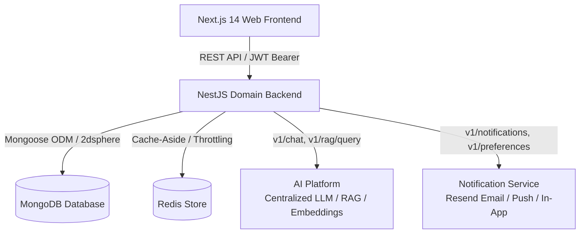

# StudySphere AI — Intelligent Study Spot & Focus Finder ☕📚🏛️

> **Autonomous Study Spot Intelligence Platform** for discovering, reviewing, and AI-matching study sanctuaries with acoustic decibel benchmarking, WiFi speed testing, power socket mapping, and personalized study persona matching.

Part of the **AI Engineering Portfolio Ecosystem** by [Rishank Kesarwani](https://github.com/rishank-kesarwani).

---

## 🏛️ Ecosystem Architecture & Shared Services Integration

`StudySphere AI` is engineered to integrate cleanly into a multi-service AI portfolio. It does **not** duplicate LLM logic or notification providers inside the domain backend, delegating instead to dedicated shared infrastructure via resilient HTTP clients.



### Shared Ecosystem Components:
1. **[AI Platform](https://github.com/rishank-kesarwani/ai-platform)** (`http://localhost:5000` / `AI_PLATFORM_URL`):
   - Centralized LLM gateway, RAG vector retrieval, memory, token counting, and cost monitoring.
   - Accessed via [`AiPlatformClient`](backend/src/modules/ai-platform/ai-platform.client.ts) with timeout handling and graceful offline fallback.
2. **[Notification Service](https://github.com/rishank-kesarwani/notification-service)** (`http://localhost:3001` / `NOTIFICATION_SERVICE_URL`):
   - Multi-channel notification pipeline (Email, Push, In-App).
   - Accessed via [`NotificationClientService`](backend/src/modules/notifications/notification-client.service.ts) using idempotency keys (`welcome_<userId>`, `pwd_reset_<userId>_<ts>`).
3. **Reference Application**:
   - **[AI Travel Planner](https://github.com/rishank-kesarwani/ai-travel-planner)**

---

## ✨ Core Features

- **Acoustic Noise Benchmarking**: Classified into *Silent Focus*, *Whisper Quiet*, *Moderate Chatter*, and *Energetic Buzz*.
- **WiFi & Connectivity Testing**: Benchmarked download/upload speeds in Mbps with reliability tags (Ultra Fiber, Fast, Decent).
- **Power Outlet Mapping**: Sockets at every desk, near walls & booths, or battery only.
- **AI Study Spot Concierge**: Natural language study assistant powered by Gemini 1.5 Pro with task-based reasoning, grounded RAG candidate scoring, and token telemetry.
- **Interactive Multi-Dimensional Search & Split Map View**: Real-time filtering by noise level, WiFi speed, power outlets, categories (libraries, cafes, coworking, campus hubs), and distance.
- **Community Acoustic Reviews & Check-Ins**: Verified community ratings, pro tips, and helpfulness voting.
- **Custom Study Playlists & Bookmarks**: Organize spots by study goals (e.g. *Thesis Writing*, *Weekend Coding*, *Finals Cramming*).
- **Enterprise-Grade Authentication**:
  - JWT access tokens (15m) + cryptographic refresh token rotation in database (7d).
  - Forgot password & reset password workflows with time-limited hashed tokens.
  - `LoginRequiredModal` offering fluid UX for guest interactions without unexpected redirects.
- **Resilience & Rate Limiting**:
  - Centralized exception filters (`AllExceptionsFilter`).
  - Structured request logging with UUID `x-request-id` tracing.
  - NestJS Throttler rate limiting behind proxies.
  - Redis cache-aside invalidation.

---

## 🛠️ Tech Stack

### Backend
- **Framework**: NestJS (TypeScript, Node.js 20)
- **Database**: MongoDB via `@nestjs/mongoose` with `2dsphere` geospatial indexing
- **Caching & State**: Redis via `ioredis`
- **Security & Validation**: Passport JWT, Helmet, class-validator, class-transformer, bcryptjs
- **API Documentation**: Swagger OpenAPI (`/api/docs`)
- **Health Probes**: `@nestjs/terminus` (MongoDB, Redis, AI Platform, Notification Service)
- **Testing**: Jest unit & service test suites

### Frontend
- **Framework**: Next.js 14 (App Router, React 18, TypeScript)
- **Styling**: Tailwind CSS with tailored dark study palette & glassmorphism
- **Icons**: Lucide React
- **HTTP Client**: Axios with automatic JWT renewal interceptor queue

---

## 🚀 Getting Started

### Prerequisites
- Node.js 20+
- MongoDB instance (local or Atlas)
- Redis instance (local or Cloud)
- (Optional) Docker & Docker Compose

### 1. Backend Setup

```bash
cd backend
cp .env.example .env

# Install dependencies
npm install --legacy-peer-deps

# Seed realistic study spots & test accounts
npm run seed

# Run unit tests
npm test

# Start in development mode
npm run start:dev
```
- API Server: `http://localhost:4000/api`
- Swagger Docs: `http://localhost:4000/api/docs`

#### Demo Credentials Created by Seed:
- **Admin**: `admin@studyspot.ai` / `AdminPassword123!`
- **User**: `scholar@studyspot.ai` / `DemoPassword123!`

---

### 2. Frontend Setup

```bash
cd frontend
cp .env.example .env.local

# Install dependencies
npm install --legacy-peer-deps

# Start Next.js development server
npm run dev
```
- Web Application: `http://localhost:3000`

---

### 3. Docker Compose (Full-Stack)

```bash
docker-compose up --build
```

---

## 🧪 Testing

```bash
# Run backend test suite
cd backend
npm test

# Run build verification
npm run build
cd ../frontend
npm run build
```

---

## 🔒 Security & Best Practices

- **Zero Secret Exposure**: Internal AI Platform keys and Notification Service keys are isolated in backend environment variables.
- **Refresh Token Rotation**: Refresh tokens are hashed in MongoDB and rotated on each usage.
- **Request Tracing**: `x-request-id` header is attached to every incoming HTTP request and forwarded across logs.
- **Sanitized Exceptions**: No raw database errors or stack traces are leaked to client applications in production.

---

## 📄 License
MIT © [Rishank Kesarwani](https://github.com/rishank-kesarwani)
